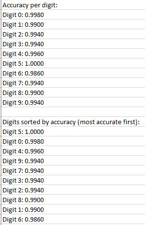

# Conversion to Python using Pytorch of 
### https://www.mathworks.com/help/deeplearning/ug/train-network-with-multiple-outputs.html 

# New Features
* Addition of validation test with early stopping
* Loss, Accuracy, RMSE and Angle Regression Plots
* Confusion Matrix
* Accuracy Per Digit Output
* Improved loss function to balance classification and regression outputs
* MATLAB: accuracy = 0.9732; Regression RMSE = 6.93
* Python: accuracy = 0.9936; Regression RMSE = 6.27

