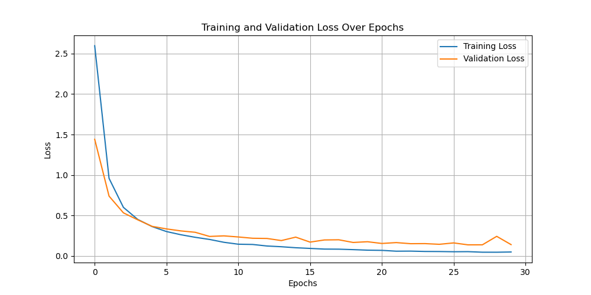
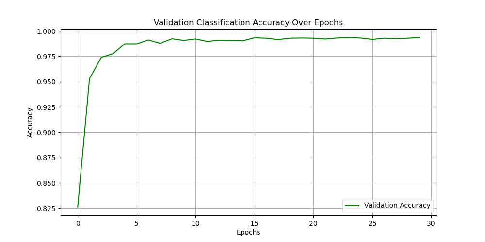
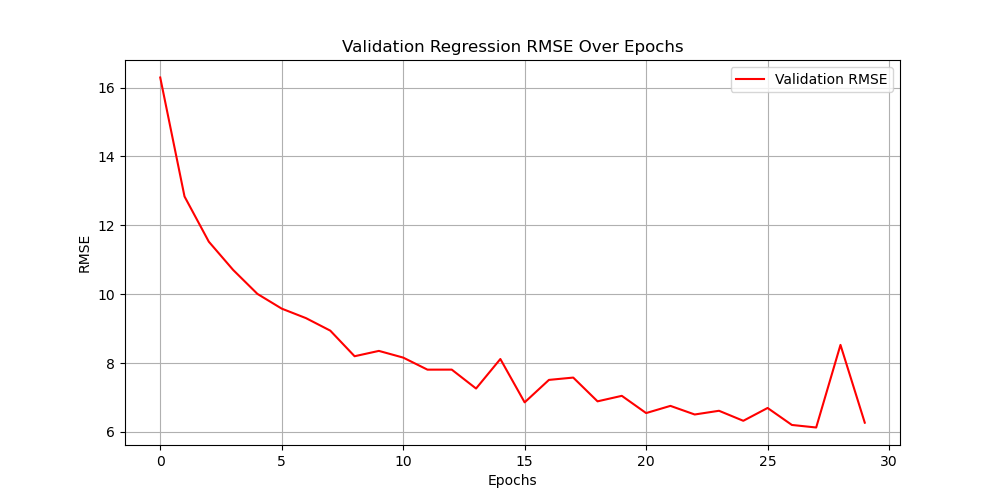
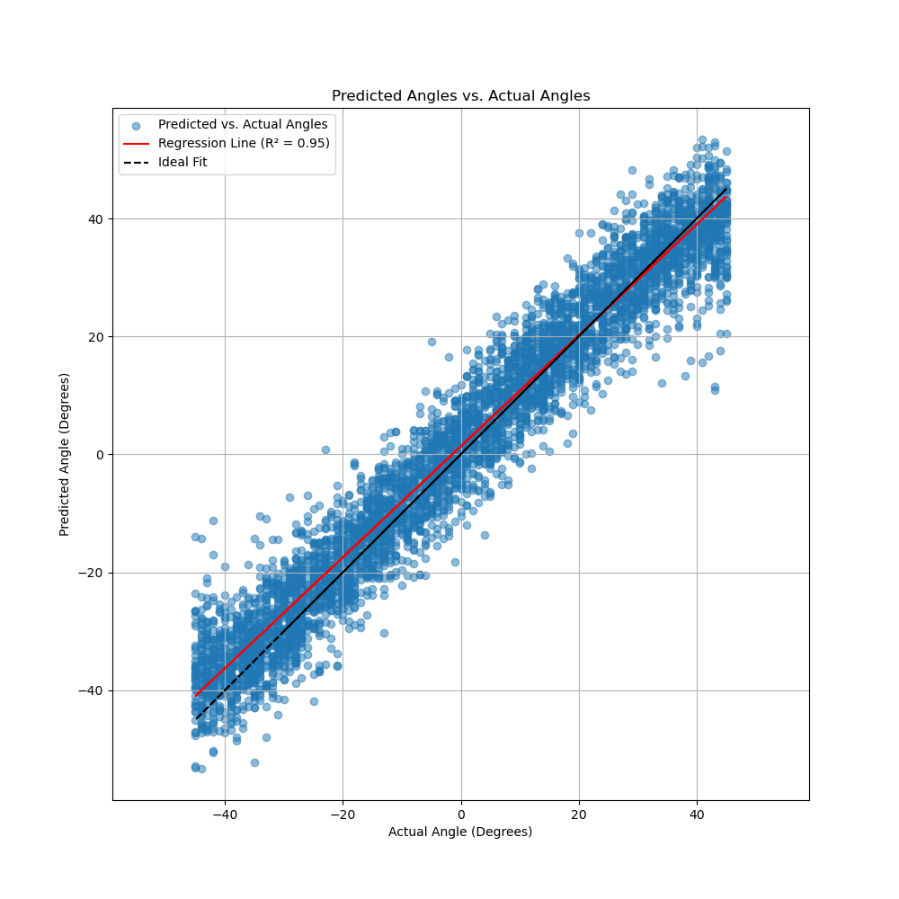
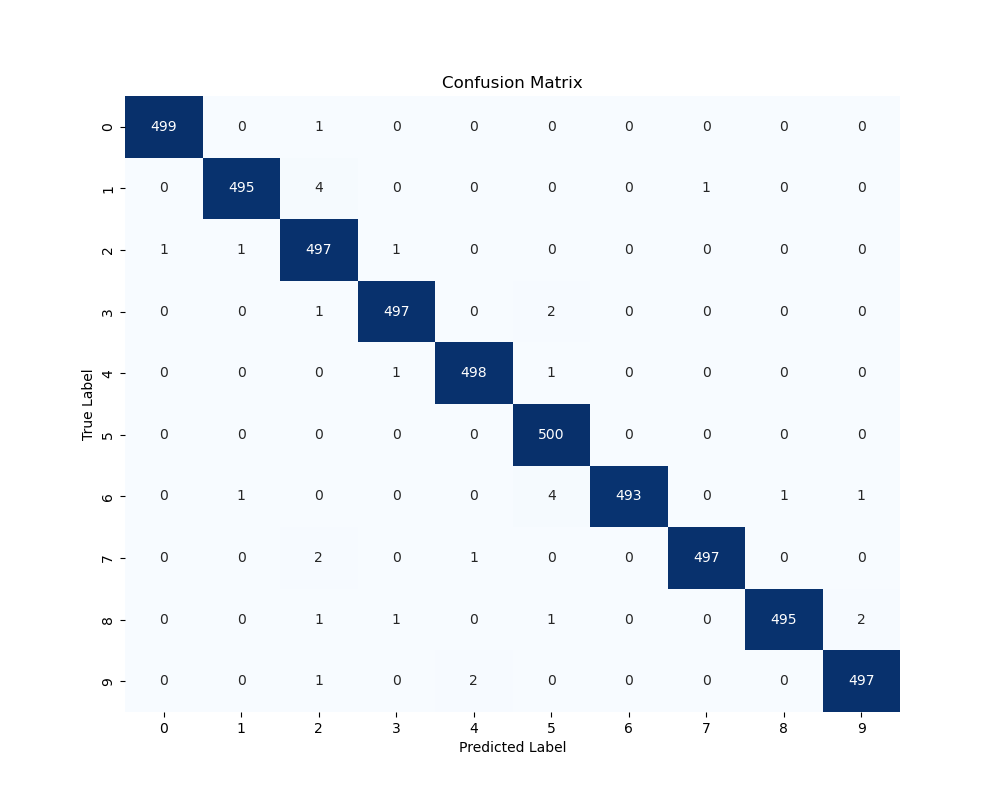

# Conversion to Python using Pytorch of 
### https://www.mathworks.com/help/deeplearning/ug/train-network-with-multiple-outputs.html 

# New Features
* Addition of validation check
* Loss, Accuracy, RMSE and Angle Regression Plots
* Confusion Matrix
* Accuracy Per Digit Output

